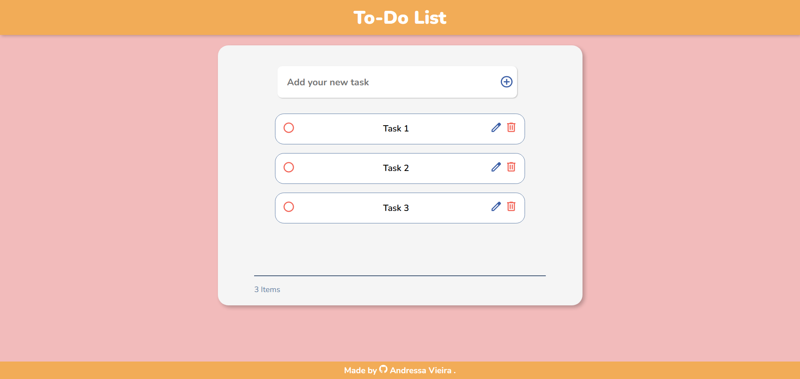
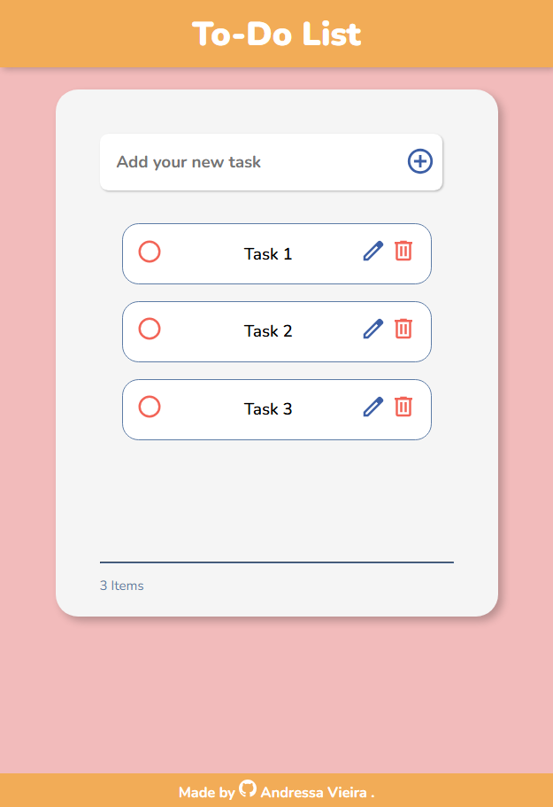

# To-Do List 📋

This is a simple To-Do list using local storage so you don't lose your tasks after closing the page.

## Table of contents

- [Overview](#overview)
  - [Screenshots](#screenshots)
  - [Links](#links)
  - [Built with](#built-with)
- [Acknowledges](#acknowledges)

## Overview

### Screenshots

💻 Large Screens

📱 Small Screens

### Links

- Live Site URL: [GitHub Pages](https://ansomething.github.io/to-do-list/)

### Built with

- Visual Studio Code
- HTML5
- CSS
- JavaScript
- Mobile-First Workflow
- Adobe Colors
- Google Fonts

### Acknowledges

Hello! This is another small project I've been working on to practice and also learn more stuff. It took me almost three days to do it since I was struggling with the layout and, of course, with the JavaScript. (I've done it with the help of MDN documentation, YouTube videos and articles!)

There's some features I would like to add in the future, like a calendar so you can add specific tasks to specific days, but right now I'm proud of the results.

If you're seeing this, thank you for your interest!
